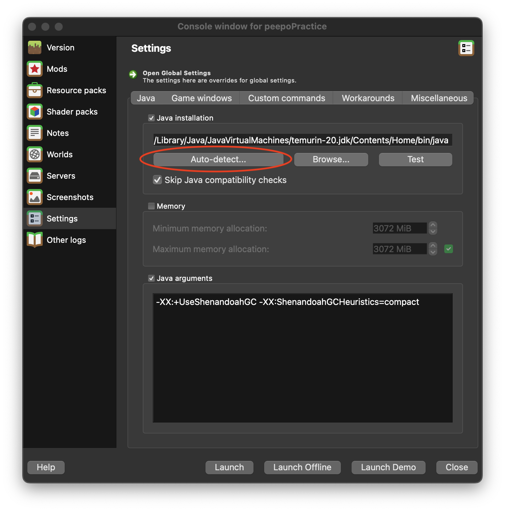
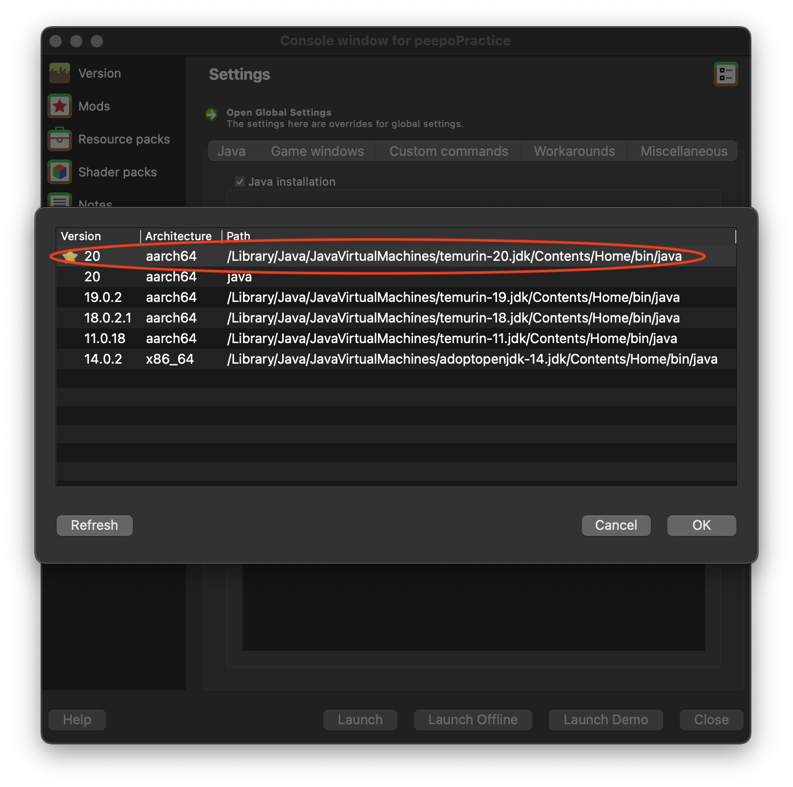
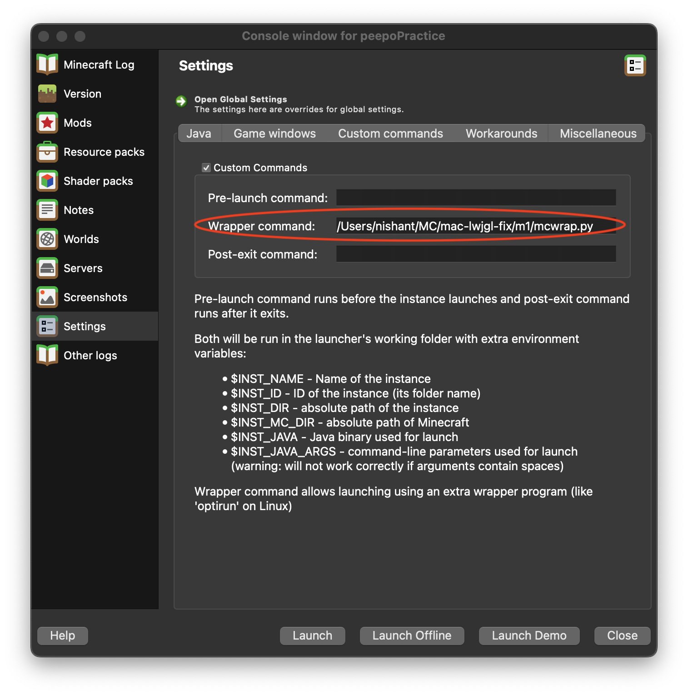

# mac-lwjgl-fix

NOTE: for anyone using an Apple Silicon Mac who just wants native performance and doesn't care about minor bugs, you can simply download [Prism Launcher](https://prismlauncher.org/) and use a native Apple Silicon-compatible JDK. If using Prism Launcher, make sure to enable "Skip Java compatibility checks" in Settings > Java to avoid issues with launching an instance.

When moving to version 1.13, Minecraft updated from LWJGL 2 to LWJGL 3. Unfortunately for macOS players, this introduced a wide variety of bugs that specifically happened on Macs. Despite the long time since 1.13, several of these bugs have persisted in newer versions of Minecraft.

This repo contains a wrapper script to be used with [Prism Launcher](https://prismlauncher.org/) or [MultiMC](https://multimc.org/) that will configure any instance to use altered LWJGL files that fix several bugs on macOS. These include the inability to immediately move your mouse after opening your inventory ([MC-134546](https://bugs.mojang.com/browse/MC-134546)), the inability to scroll through your hotbar while holding shift ([MC-121772](https://bugs.mojang.com/browse/MC-121772)), the player's camera sometimes snapping after exiting the inventory ([MC-248737](https://bugs.mojang.com/browse/MC-248737)), and more. (Note: this fork and its fixes only work for versions 1.14.4 and up.)

## Setup and Usage

### Pre-requisites

First, install the [Eclipse Temurin macOS aarch64 JDK 17](https://adoptium.net/temurin/releases/?version=17) (for Apple Silicon Macs) or the [Eclipse Temurin macOS x64 JDK 17](https://adoptium.net/temurin/releases/?version=17) (for Intel Macs). You could also download newer Java versions; however, version 17 may currently be more stable.

You'll also need a standard install of either Prism Launcher or MultiMC.

### Clone this repo

Open a terminal (it's in the `Utilities` folder inside of `Applications`, if you're new to command line stuff).

To make it easy to follow along, we'll make a new directory called `MC` in our home folder. If you'd rather put this repo somewhere else, that's fine - the location doesn't really matter. If you do put it somewhere else, remember to change the references to it in the commands below.

The lines beginning with `#` below are comments and don't need to be entered, but it's fine to copy paste them in along with the rest.

```shell
# Make a place to put our wrapper script and libraries
mkdir -p ~/MC

# enter the new directory
cd ~/MC

# clone this repo
git clone https://github.com/Poleward/mac-lwjgl-fix.git
```

### Configure Prism Launcher/MultiMC

Create a new Minecraft instance in Prism Launcher/MultiMC (or duplicate an existing one), then click "Edit" in the sidebar.


Go to Settings, then make sure the "Java Installation" checkbox is checked. Then hit "Auto-detect". (If you're using Prism Launcher, make sure to check "Skip Java compatibility checks" to avoid issues with launching an instance.)



It should open a window with a list of Java versions. Find the one that says "temurin-[downloaded version]" in the path and select it, then hit OK. (You may need to resize the window to see the full path.)



Still in the Settings pane, switch to the "Custom Commands" tab. Check the "Custom Commands" checkbox. In the "Wrapper Command" box, enter the full path to the `mcwrap.py` script from this repo, e.g. `/Users/your-username/stuff/mac-lwjgl-fix/m1/mcwrap.py` for Apple Silicon Macs or `/Users/your-username/stuff/mac-lwjgl-fix/intel/mcwrap.py` for Intel Macs. An easy way to get the path is to right click the appropriate mcwrap.py file in Finder, hold the option key, and select "Copy 'mcwrap.py' as Pathname". Now you can paste it into the "Wrapper Command" box.



That's it! You should be able to launch the instance and run without several bugs.

## Optional - Global Configuration

The instructions above will enable the libs for a single Prism/MultiMC instance, but if you want, you can enable them for _all_ instances. Just enable the Temurin JDK you downloaded and set the Wrapper Command in the main Prism/MultiMC Settings window instead of the instance settings.

## Sources

The files `lwjglfat.jar` and most libraries in the `m1/lwjglnatives` folder were compiled by [Tanmay Bakshi](https://gist.github.com/tanmayb123) from the source available at https://www.lwjgl.org/source and are subject to its [BSD-style license terms](https://github.com/LWJGL/lwjgl3/blob/master/LICENSE.md). Most libraries in the `intel/lwjglnatives` folder also come directly from the aforementioned LWJGL source and are subject to the same terms. The files `libglfw.dylib` and `libopenal.dylib` were taken from https://github.com/GameParrot/minecraft-mac-window-fix.

The `mcwrap.py` script was written by [Yusef Napora](https://github.com/yusefnapora) and slightly edited by me, and is public domain.
