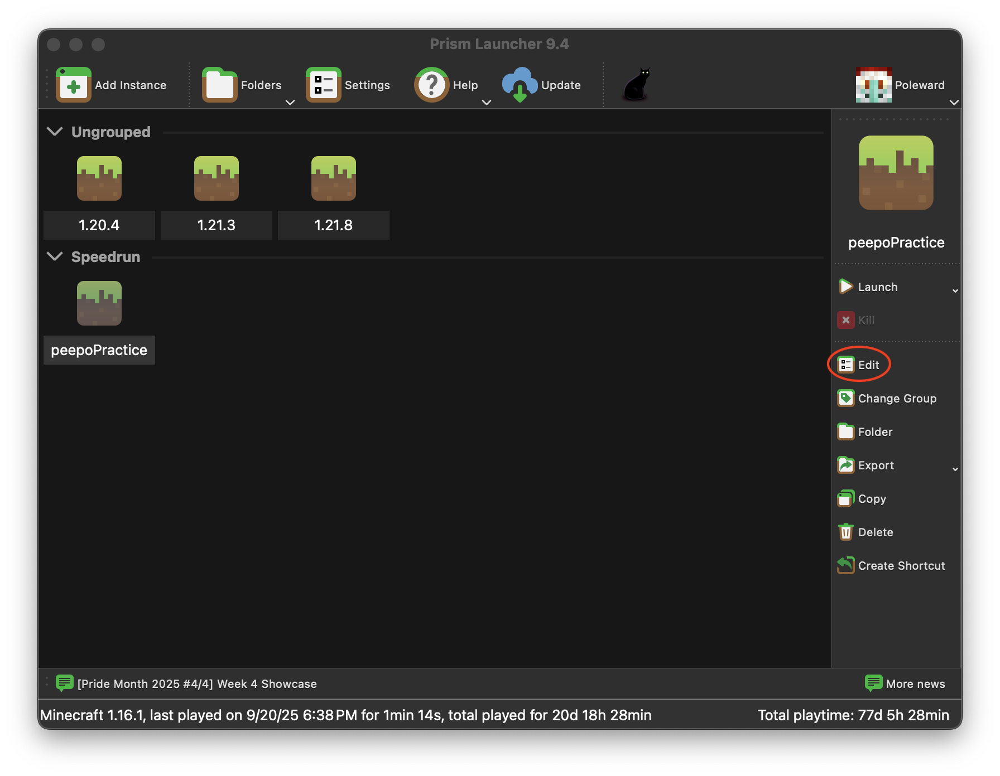

# mac-lwjgl-fix

When moving to version 1.13, Minecraft updated from LWJGL 2 to LWJGL 3. Unfortunately for macOS players, this introduced a wide variety of bugs that specifically happened on Macs. Despite the long time since 1.13, several of these bugs have persisted in newer versions of Minecraft.

This repo contains a GLFW dylib file to be used with [Prism Launcher](https://prismlauncher.org/) that will fix several bugs on macOS. These include the inability to scroll through your hotbar while holding shift ([MC-121772](https://bugs.mojang.com/browse/MC-121772)), the player's camera sometimes snapping after exiting the inventory ([MC-248737](https://bugs.mojang.com/browse/MC-248737)), and more. (Note: this fork and its fixes only work for versions 1.14.4 and up.)

## Setup and Usage

### Pre-requisites

First, make sure you have Prism Launcher 9.0+ installed.

You also want to make sure you have Java installed. Prism easily allows you to install Java by enabling "Autodetect Java version" and "Auto-download Mojang Java" in Prism Launcher > Settings > Java.

Finally, you'll need Git to clone the repository.

### Clone this repo

Open a terminal (it's in the `Utilities` folder inside of `Applications`, if you're new to command line stuff).

To make it easy to follow along, we'll make a new directory called `MC` in our home folder. If you'd rather put this repo somewhere else, that's fine - the location doesn't really matter. If you do put it somewhere else, remember to change the references to it in the commands below.

The lines beginning with `#` below are comments and don't need to be entered, but it's fine to copy paste them in along with the rest.

```shell
# Make a place to put our wrapper script and libraries
mkdir -p ~/MC

# enter the new directory
cd ~/MC

# clone this repo
git clone https://github.com/Poleward/mac-lwjgl-fix.git
```

### Ensure native file can be opened

Navigate to the `mac-lwjgl-fix` folder in Finder and open `libglfw.dylib`. You may get a warning saying that the file wasn't opened because it couldn't be verified. If so, click "Done" on the warning window.


To fix this, open the Settings app and navigate to "Privacy & Security". If you scroll down, you should see a section saying that "libglfw.dylib" was blocked from opening. Press the "Open Anyway" button and give permission for the file to be opened. This will allow Prism to actually use the updated GLFW file.


### Configure Prism Launcher/MultiMC

Create a new Minecraft instance in Prism Launcher (or duplicate an existing one), then click "Edit" in the sidebar.



Click the Settings pane and navigate to the Workarounds tab. Check the "Native libraries" checkbox, then check the "Use system installation of GLFW" checkbox. In the "GLFW library path" box, enter the full path to the `libglfw.dylib` from this repo, e.g. `/Users/your-username/MC/mac-lwjgl-fix/libglfw.dylib`. An easy way to get the path is to right click `libglfw.dylib` in Finder, hold the option key, and select "Copy `libglfw.dylib` as Pathname". Now you can paste it into the "GLFW library path" box.


That's it! You should be able to launch the instance and run without several bugs.

## Optional - Global Configuration

The instructions above will enable the custom GLFW for a single Prism instance, but if you want, you can enable them for _all_ instances. Just navigate to Settings > Minecraft > Tweaks within Prism Launcher, check "Use system installation of GLFW", and enter the path to `libglfw.dylib`. This way, you won't have to reconfigure the custom GLFW for each instance.


## Sources

`libglfw.dylib` was taken from https://github.com/GameParrot/minecraft-mac-window-fix.
